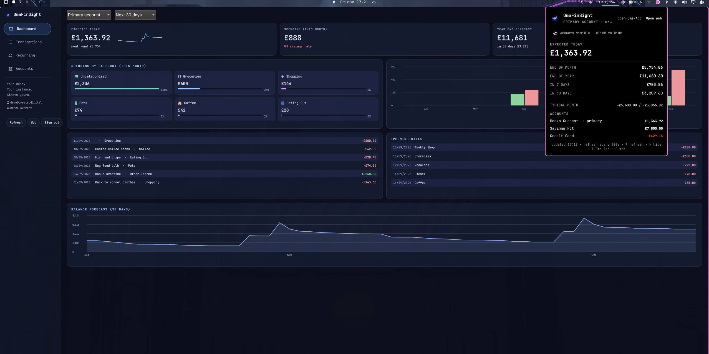

# FinSightBar



FinSight balance forecast in the Omarchy bar — your **expected balance today**, **end of month** and **end of year**, plus per-account balances and a low-balance warning glow, pulled live from your self-hosted [FinSight](https://github.com/LinuxGamerUK/FinSight) instance (Next.js, self-hosted on your own server).

**Read-only companion.** The bar shows your numbers; all data entry happens in the FinSight web app (`O` in the panel, or the *Open web* button, opens your instance in the browser).

## What it shows

- **Bar chip:** expected balance today (or month-end / year-end / nothing — configurable), turning accent-coloured under your warning threshold and urgent under your critical threshold
- **Panel:** today / month-end / year-end / +7 days / +30 days forecast, typical monthly in vs out, per-account balances, last refresh time
- **Keyboard:** `R` refreshes, `O` opens the web app, arrows scroll, `Tab` switches panels

## Install

```sh
omarchy plugin install https://github.com/LinuxGamerUK/finsightbar
```

Or manually:

```sh
git clone https://github.com/LinuxGamerUK/finsightbar.git \
  ~/.config/omarchy/plugins/com.github.linuxgameruk.finsightbar
omarchy-shell shell rescanPlugins
omarchy plugin enable com.github.linuxgameruk.finsightbar right
omarchy-restart-shell
```

To remove:

```sh
omarchy plugin disable com.github.linuxgameruk.finsightbar
rm -rf ~/.config/omarchy/plugins/com.github.linuxgameruk.finsightbar
rm -rf ~/.local/state/finsightbar   # removes the stored session
```

## First run

1. Click the bar icon — the panel shows a sign-in form.
2. Enter the email + password you use on your FinSight web instance.
3. That's it. The session cookie is stored locally (see Privacy); your password is never saved.

You need a running FinSight instance somewhere you can reach (self-hosted, e.g. on your own server via Tailscale/LAN, or a public URL). The instance URL is set in the widget settings (default `https://finsight.cresta.digital`, the author's public instance — point it at your own).

## Settings

| Setting | Default | Description |
|---|---|---|
| Refresh interval | 900s | How often to poll the API (min 120s) |
| Base URL | finsight.cresta.digital | Your FinSight instance |
| Warning threshold | 500 | Balance under this → accent colour |
| Critical threshold | 200 | Balance under this → urgent colour |
| Bar shows | today | `today` / `month-end` / `year-end` / `none` |
| Account scope | primary | `primary` account or `all` accounts combined |

## Privacy & security

- **Your credentials go only to your FinSight instance.** The password is sent once over HTTPS to the `/api/auth/login` endpoint you configured, and is never written to disk.
- **The session cookie is stored locally** at `~/.local/state/finsightbar/session.txt` with `0600` permissions (directory `0700`). It is a bearer token for *your* instance only.
- The password travels over **stdin** into the login process — it never appears in a process argument list, so it can't leak via `/proc/<pid>/cmdline`.
- No telemetry, no third-party calls, no analytics. The plugin talks to exactly one host: the base URL you configure.
- **Sign out** = delete the session: `rm -rf ~/.local/state/finsightbar`.

## Dependencies

- Omarchy (with the Quickshell shell) — this is a bar plugin
- `curl` (pre-installed on Omarchy/Arch)
- A reachable FinSight instance (self-hosted — see the [FinSight repo](https://github.com/LinuxGamerUK/FinSight) to run your own; it's a single Node.js app + SQLite)

## Privileges

None. The plugin runs entirely as your user, makes no privileged calls, installs no services, and never downloads or executes third-party code at runtime.

## License

MIT — see [LICENSE](LICENSE).